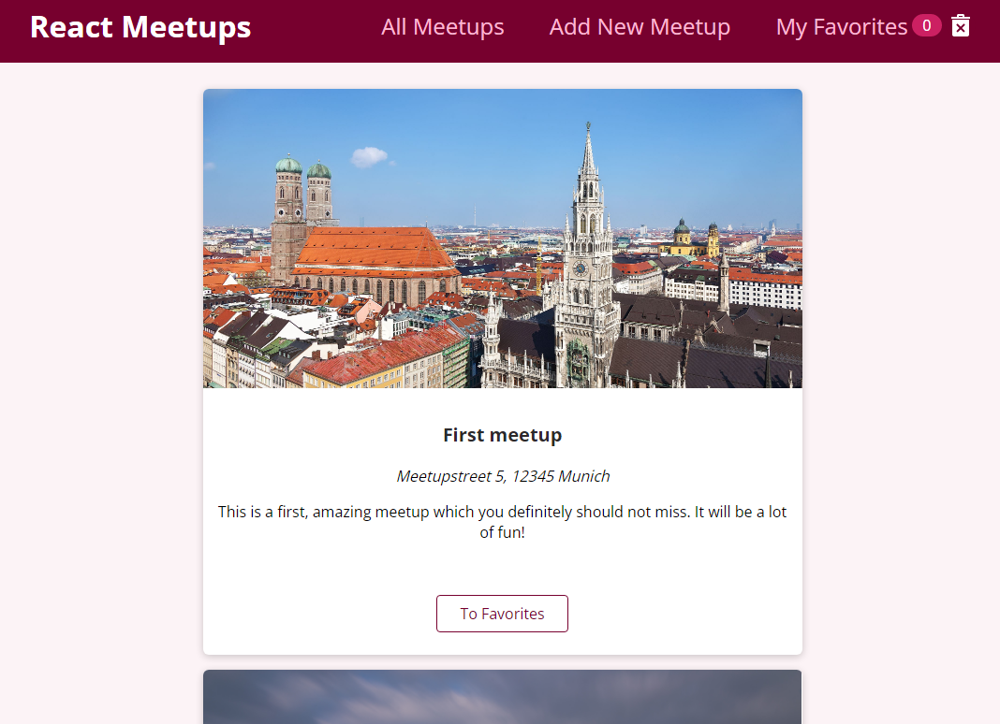

# Meetup app

> A small app for creating and managing meetups build with React.js  
> Check live demo [_here_](https://meetup-app-ca8e7.web.app/).

## Table of Contents

- [General Info](#general-information)
- [Technologies Used](#technologies-used)
- [Features](#features)
- [Screenshots](#screenshots)
- [Setup](#setup)
- [Acknowledgements](#acknowledgements)
- [Contact](#contact)

## General Information

- This project was built whilst doing course on React.js (more info in the section [Acknowledgements](#acknowledgements)).
- In contrary to what was originally built by the instructor I've modified on my own the project to use React 18.
- Additionally I've modified app to be responsive and to look good on all devices (at first project was focused on the desktops). I've added few components needed for improving UI e.g. animated Backdrop, Modal, Spinner etc.

## Technologies Used

- [React 18](https://reactjs.org/blog/2022/03/29/react-v18.html)
- [React-DOM](https://www.npmjs.com/package/react-dom)
- [React-Router](https://github.com/remix-run/react-router)
- [React Hooks](https://reactjs.org/docs/hooks-intro.html)
- [React Transition Group](https://reactcommunity.org/react-transition-group/)
- [ESLint](https://www.npmjs.com/package/eslint)
- [Prettier](https://www.npmjs.com/package/prettier)

## Features

Project allows to:

- Save meetups to the database stored on Firebase
- View the meetups saved in the database
- Mark some of the available meetups as favorite one

## Screenshots



## Setup

To run this project locally:

```
#Clone this repository
$git clone https://github.com/noszczykmichal/meetup-app
#Go into the repository
$cd meetup-app
#Install dependencies
$npm install
#Run the app
$npm start
```

## Acknowledgements

This project was based on one of the projects that can be found in [React - The Complete Guide](https://www.udemy.com/course/react-the-complete-guide-incl-redux/) by Maximilian Schwarzmüller.

## Contact

Created by [@noszczykmichal](https://noszczykmichal.github.io/portfolio/index.html#contact) - feel free to contact me!
